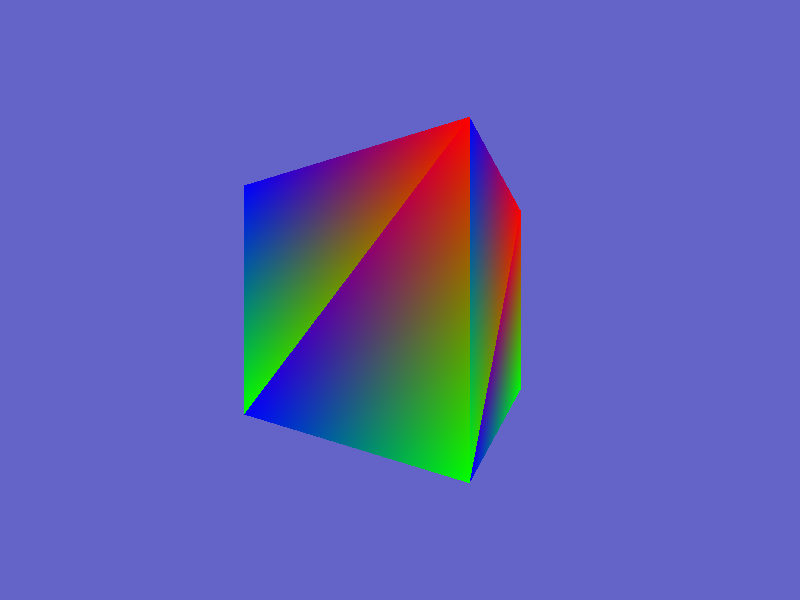

# RasterFari

[](https://github.com/Th3D0c0/RasterFari/actions/workflows/build.yml)

A software rasterizer written in C. Triangles are transformed and filled on the
CPU into a colour buffer — no GPU rendering API does the drawing — and the
finished buffer is blitted to a window through
[RGFW](https://github.com/ColleagueRiley/RGFW).



## Features

- Triangle rasterization using barycentric coordinates
- Line rasterization using the Bresenham algorithm
- Model / view / projection matrix pipeline with perspective projection
- Backface culling
- glTF (`.glb`) mesh loading via [cgltf](https://github.com/jkuhlmann/cgltf)
- Frame rate shown in the window title

## Controls

| Key   | Action |
| ----- | ------ |
| `Esc` | Quit   |

## Building

RasterFari builds with CMake. RGFW and cgltf are vendored in `include/`, so the
only things you need to install are a compiler, CMake, and your platform's
windowing and OpenGL development packages.

### Windows

**Prerequisites**

- [CMake](https://cmake.org/download/), available on your `PATH`
- Visual Studio 2022 with the **Desktop development with C++** workload, which
  provides the MSVC compiler

**Build and run**

```bat
cmake -B build
cmake --build build --config Release
cd build\Release
RasterFari.exe
```

For a debug build use `--config Debug`; the executable is then in
`build\Debug`. Only the MSVC toolchain is tested on Windows.

### Linux

**Prerequisites**

Debian / Ubuntu:

```bash
sudo apt install build-essential cmake libx11-dev libxrandr-dev \
                 libxcursor-dev libxi-dev libxext-dev libgl1-mesa-dev
```

Arch:

```bash
sudo pacman -S base-devel cmake libx11 libxrandr libxcursor libxi libxext mesa
```

Fedora:

```bash
sudo dnf install gcc cmake libX11-devel libXrandr-devel libXcursor-devel \
                 libXi-devel libXext-devel mesa-libGL-devel
```

**Build and run**

```bash
cmake -B build -DCMAKE_BUILD_TYPE=Release
cmake --build build
cd build
./RasterFari
```

For a debug build use `-DCMAKE_BUILD_TYPE=Debug`.

## Assets

The build copies `assets/` next to the executable, and RasterFari loads
`assets/Cube.glb` relative to the current working directory — so run the binary
from the directory it was built into. If the mesh cannot be found, RasterFari
reports it and exits instead of crashing.

## License

MIT — see [LICENSE](LICENSE).
